# Sprawozdanie z zadań 1, 2, 3 z [listy 7](https://cs.pwr.edu.pl/gotfryd/dyd/mps2021_22/ex/pbb_ex7_v2.pdf)

Przedmiot: Metody Probabilistyczne i Statystyka
Autor: Maciej Bazela  
Numer indeksu: 261743
Grupa: Środa 11:15

## Zadanie 1:

*Po zakończeniu symulacji, korzystając z zebranych danych, dla każdej z badanych statystyk (Bn, Un, Ln, Cn, Dn oraz Dn − Cn) przedstaw na wykresach wyniki poszczególnych powtórzeń (k punktów danych dla kazdego n) oraz średnią wartość statystyki jako funkcję n.*

Wykonane wykresy:
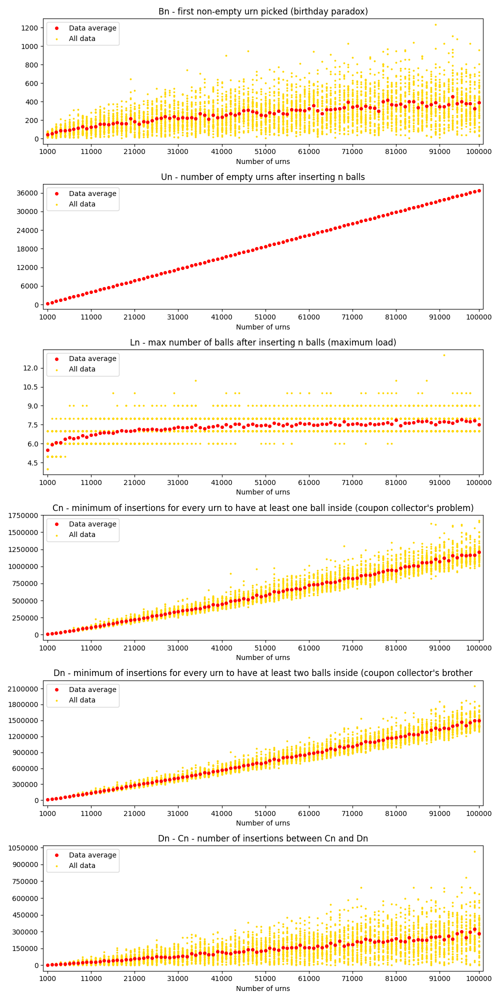

*Dodatkowo wykonaj następujace wykresy:*
* $\frac{b(n)}{n}$ oraz $\frac{b(n)}{\sqrt{n}}$ jako funkcja n,
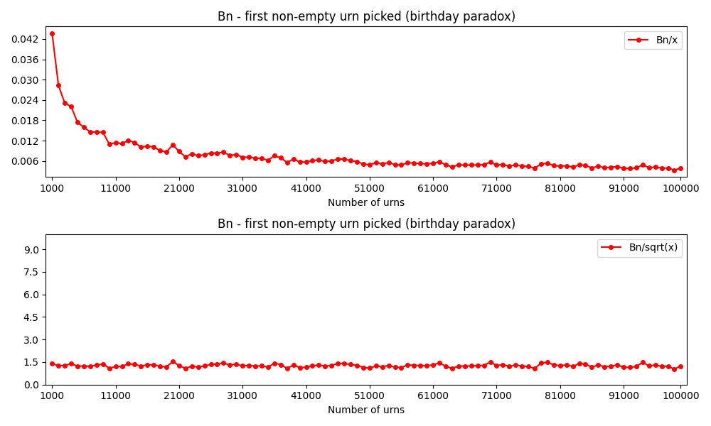

* $\frac{u(n)}{n}$ jako funkcja n,
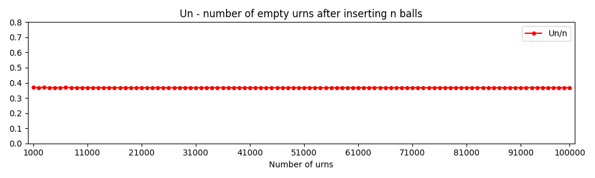

* $\frac{l(n)}{\ln{n}}$, $\frac{l(n)}{\frac{\ln{n}}{\ln{\ln{n}}}}$ oraz $\frac{l(n)}{\ln{\ln{n}}}$ jako funkcja n,
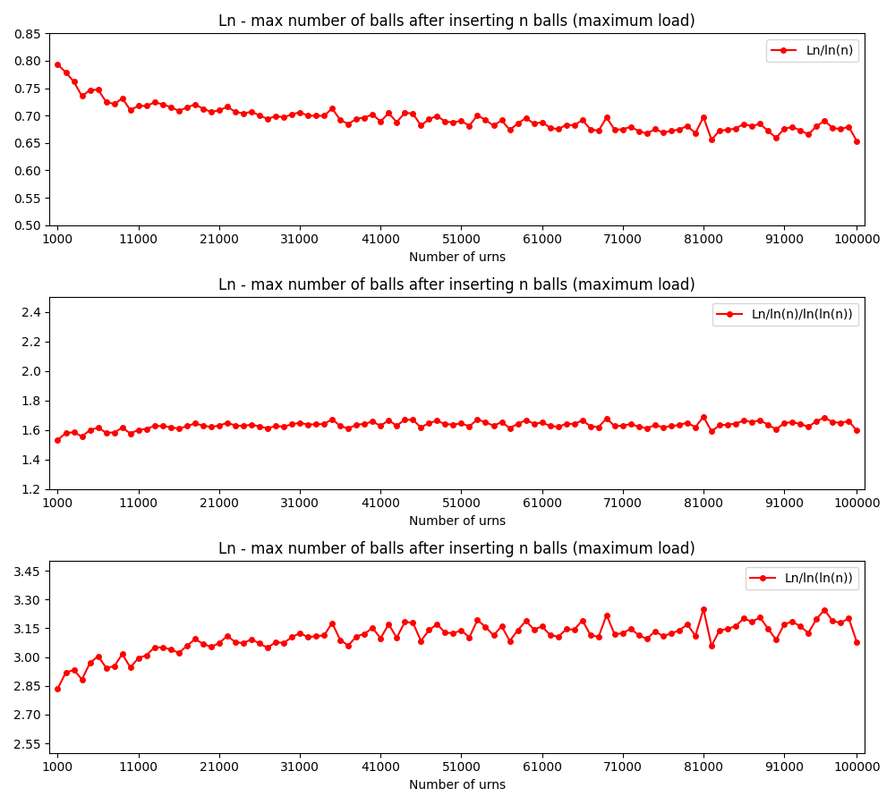

* $\frac{c(n)}{n}$, $\frac{c(n)}{n\ln{n}}$ oraz $\frac{c(n)}{n^2}$ jako funkcja n,
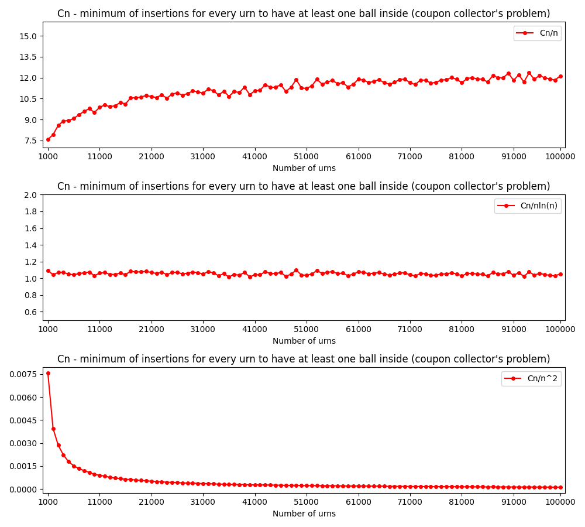

* $\frac{d(n)}{n}$, $\frac{d(n)}{n\ln{n}}$ oraz $\frac{d(n)}{n^2}$ jako funkcja n,
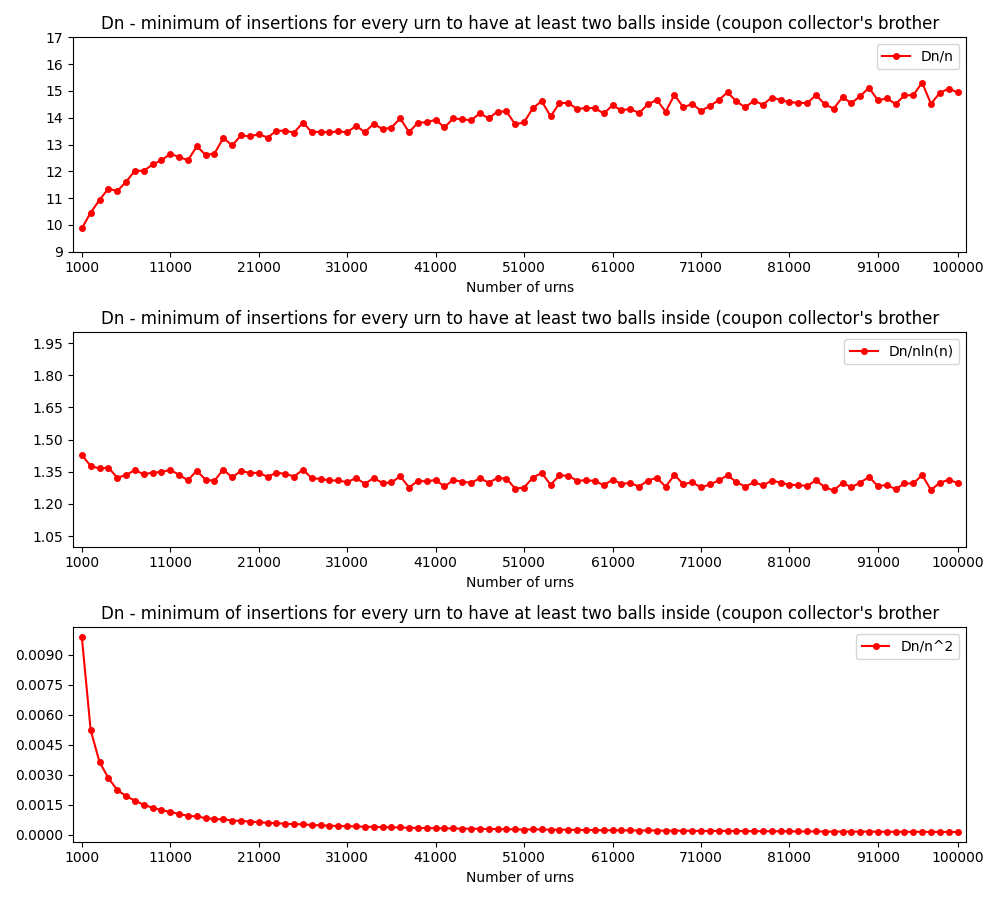

* $\frac{d(n)-c(n)}{n}$, $\frac{d(n)-c(n)}{n\ln{n}}$ oraz $\frac{d(n)-c(n)}{n\ln{\ln{n}}}$ jako funkcja n,
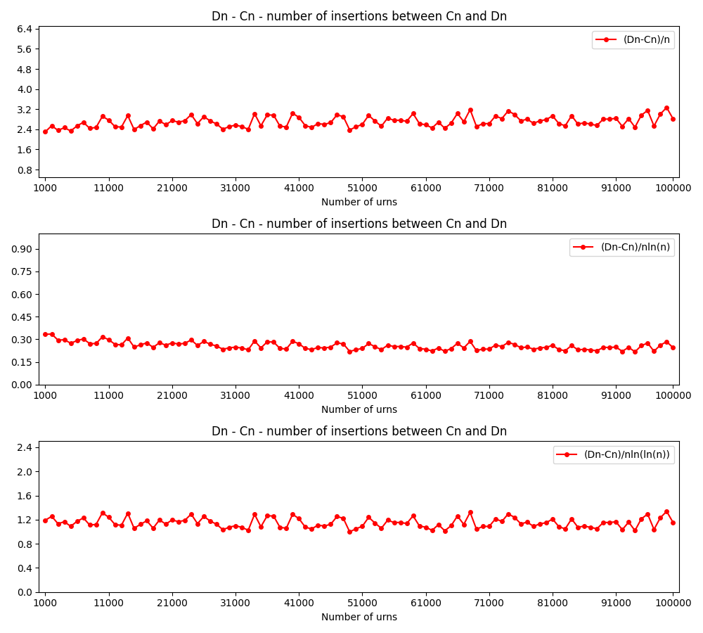

*Na podstawie wykresów postaw rozsądne hipotezy odnośnie asymptotyki średnich wartości badanych statystyk.*  

Z pierwszych wykresów statystyk możemy zauważyć, że większość z nich (Bn, Un, Cn, Dn, Dn-Cn) przypomina funkcje liniowe, a Ln - funkcję logarytmiczną.

Aby dobrze wyznaczyć asymptotykę funkcji $b(n)$, $u(n)$, $c(n)$, $d(n)$, $d(n)-c(n)$ musimy skorzystać z notacji "dużego O" (Big O notation).

Funkcja $f(n)$ należy do $\Theta(g(n))$, jeśli $\exists{k_1>0}\exists{k_2>0}\exists{n_0}\forall{n > n_0}:k_1*g(n)\leq{|f(n)|}\leq{k_2*g(n)}$ 
oraz $\displaystyle{\lim_{x \to \infty}\sup\frac{|f(n)|}{g(n)}}<\infty$ i $\displaystyle{\lim_{x \to \infty}\inf\frac{|f(n)|}{g(n)}}>0$
Czyli po prostu, jeśli $g(n) \xrightarrow{}{c}$, gdzie c to jakaś skończona stała, większa od 0, to wtedy $f(n)$ rośnie asymptotycznie tak szybko jak $g(n)$.

Korzystając z tych faktów, możemy dzięki wykresom w 2 części zdania ustalić asymptotykę tych statystyk:
* $b(n) = \Theta(\sqrt{n})$, bo funkcja $\frac{b(n)}{n}$ dąży do 0, a $\frac{b(n)}{\sqrt{n}}$ osiąga wartość ok. $1.5$,
* $u(n) = \Theta(n)$, bo funkcja $\frac{u(n)}{n} \approx 0.37$
* $l(n) = \Theta(\frac{\ln{n}}{\ln{\ln{n}}})$, bo funkcja $\frac{l(n)}{\ln{n}}$ jest malejąca, a $\frac{l(n)}{\ln{\ln{n}}}$ jest rosnąca, a $\frac{l(n)}{\frac{\ln{n}}{\ln{\ln{n}}}} \approx 1.6$,
* $c(n) = \Theta(n\ln{n})$, bo funkcja $\frac{c(n)}{n}$ jest rosnąca, a $\frac{c(n)}{n^2}$ jest malejąca, a $\frac{c(n)}{n\ln{n}} \approx 1.1$,
* $d(n) = \Theta(n\ln{n})$, bo funkcja $\frac{d(n)}{n}$ jest rosnąca, a $\frac{d(n)}{n^2}$ jest malejąca, a $\frac{d(n)}{n\ln{n}} \approx 0.3$,

Z notacji $\Theta$ nie możemy zbytnio ustalić $d(n) - c(n)$, ponieważ ta różnica nie ustala nam jednoznacznie ograniczenia z dołu, dlatego nie możemy jednoznacznie określić do czego zbiega ta różnica.

## Zadanie 2:

*Przedstaw uzyskane wyniki jak w zadaniu 1 oraz porównaj je z rezultatami otrzymanymi w zadaniu 1 dla przypadku d = 1.*
Z zadania 1:
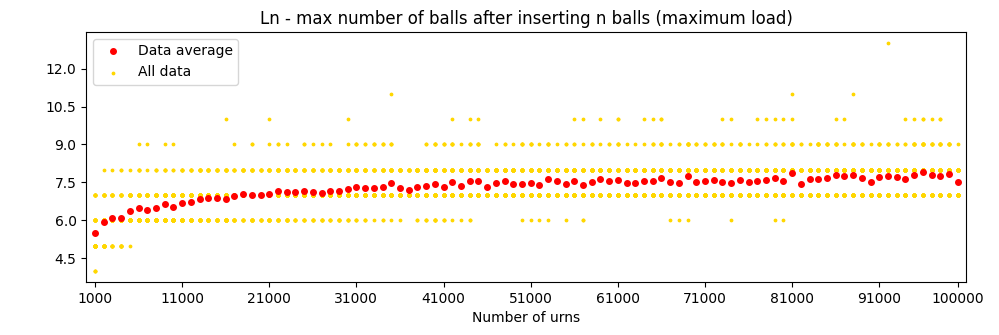
Z zadania 2:
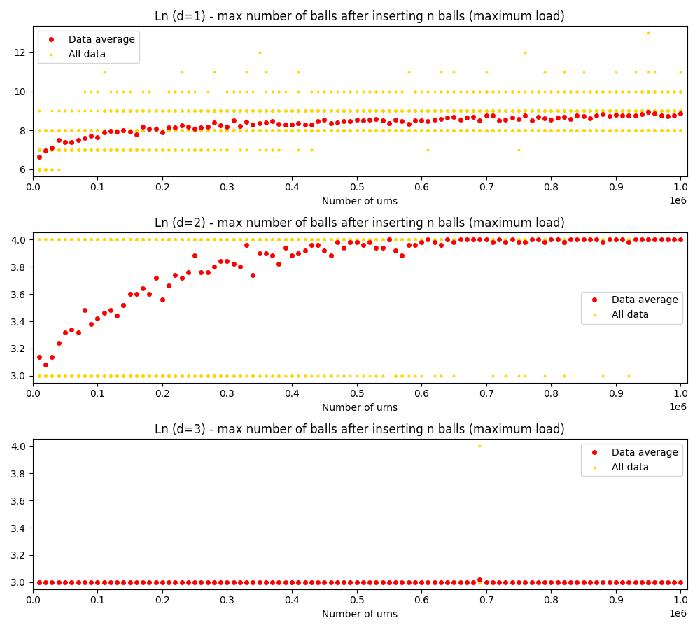

Kontynuując rozumowanie jak w zad 1, funkcje dla d=1 i d=2 należą do $\Theta(\frac{\ln{n}}{\ln{\ln{n}}})$
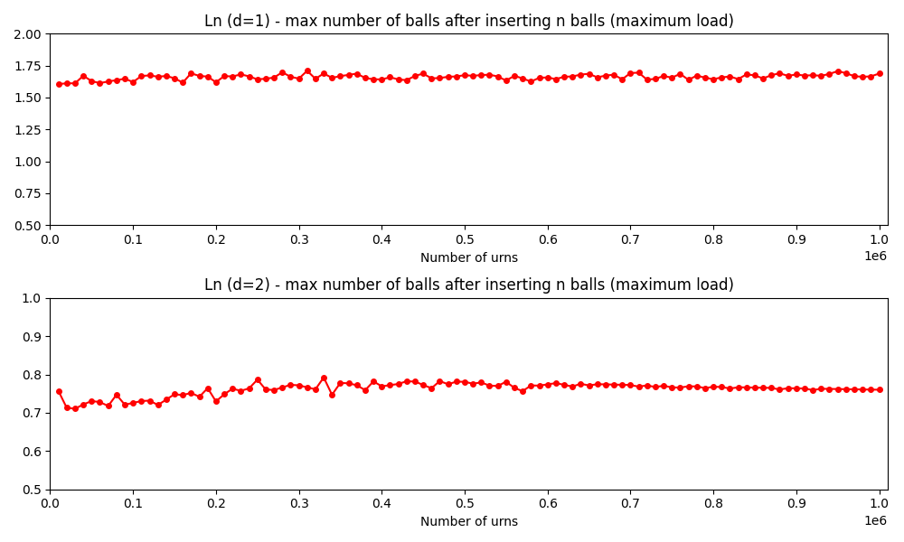

**Uwaga w wykresach z zadania 2 przeskalowałem x przez 1e6**

## Zadanie 3:

*Po zakonczeniu programu, korzystając z zebranych danych, przedstaw na wykresach:*
*Sprawdź, jak wykresy zmieniają się dla róznych wartości k (np. k = 1, k = 10, k = 100).*
* *liczbę wykonanych porównan w poszczególnych powtórzeniach oraz srednią liczbę porównan $cmp(n)$ w zależności od n,*
* *liczbę przestawień w poszczególnych powtórzeniach oraz średnię liczbę przestawień kluczy $s(n)$ w zależności od n,*
* *czas działania dla poszczególnych powtórzeń oraz średni czas działania algorytmu w zależności od n,*
* *iloraz $\frac{cmp(n)}{n}$ oraz $\frac{cmp(n)}{n^2}$ w zależności od n,*
* *iloraz $\frac{s(n)}{n}$ oraz $\frac{s(n)}{n^2}$ w zależności od n:*

### Dla k = 1:
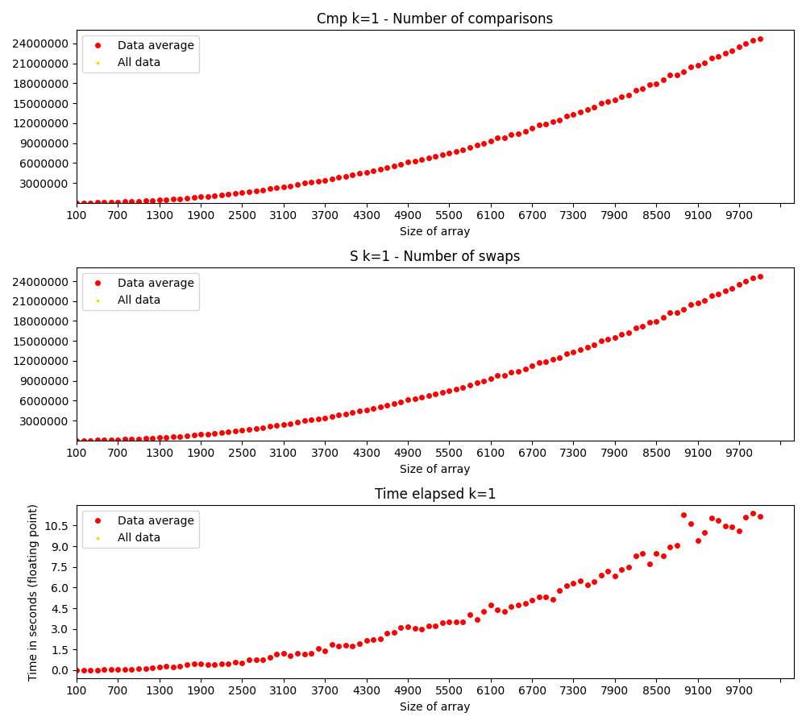
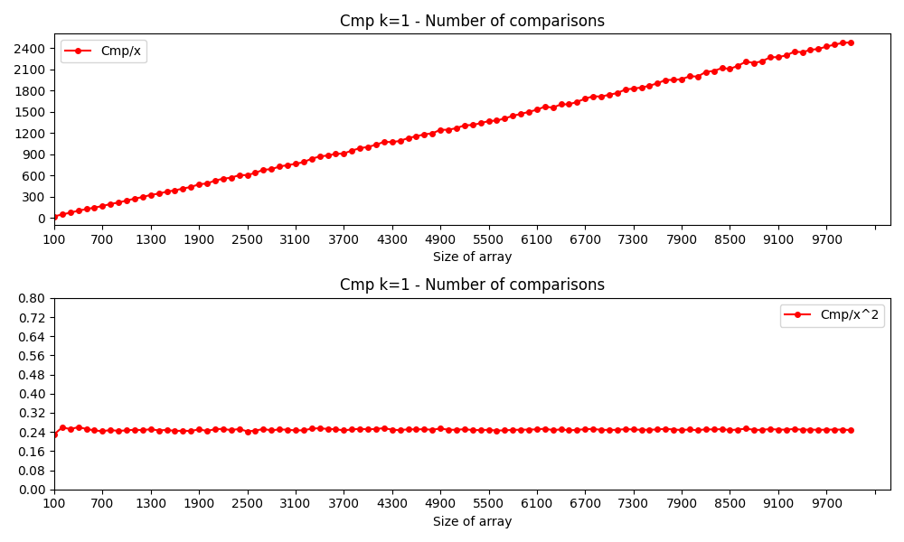
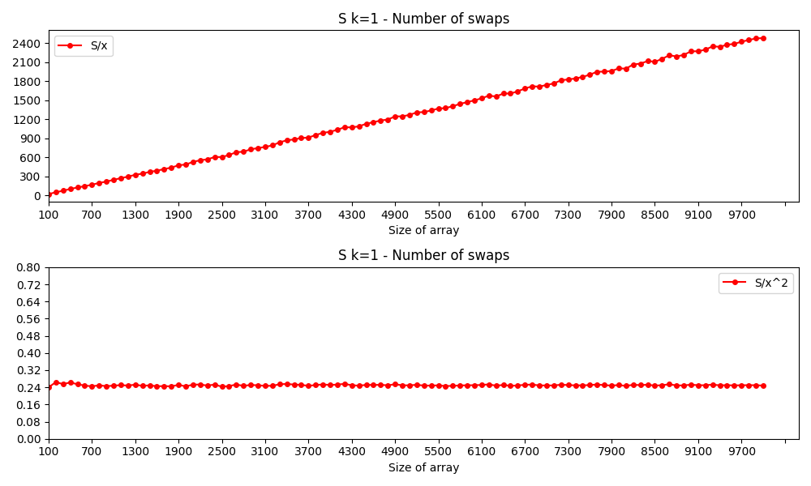

### Dla k = 10:
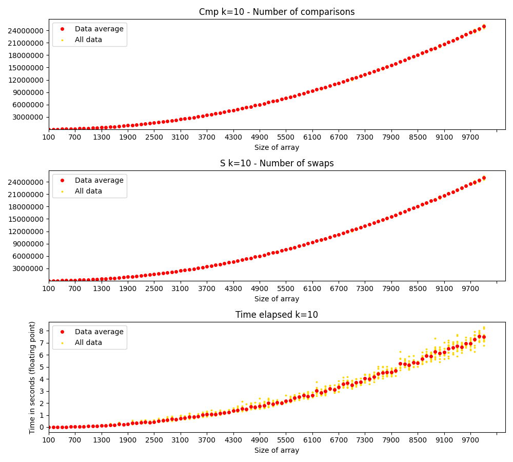

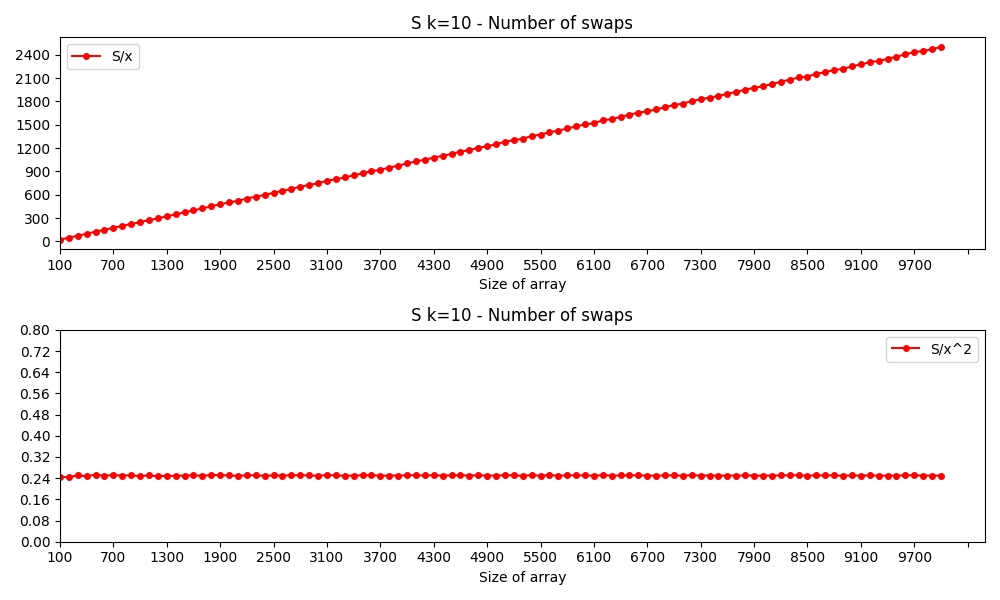

### Dla k = 50:
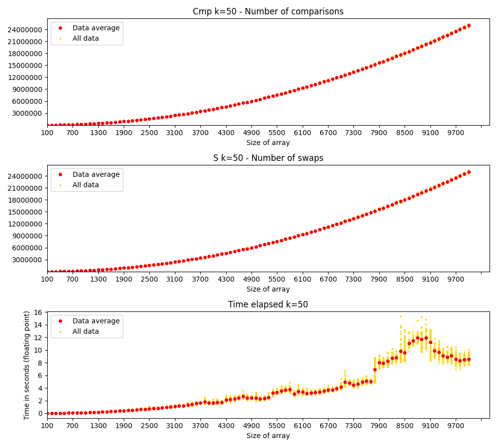

### Dla k = 100:
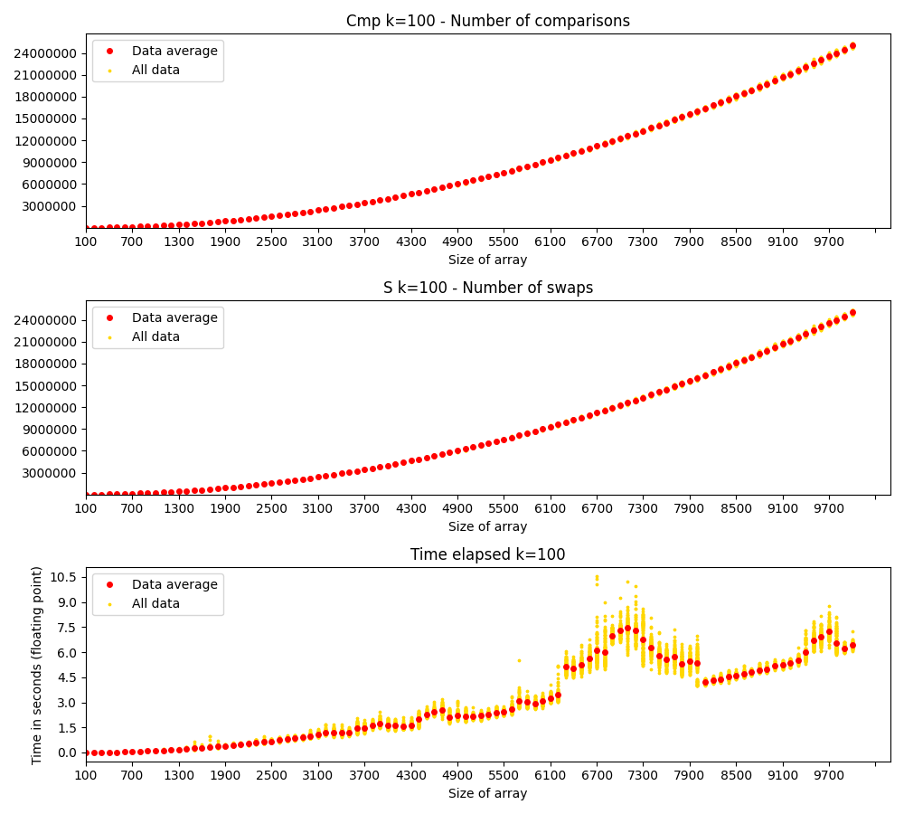

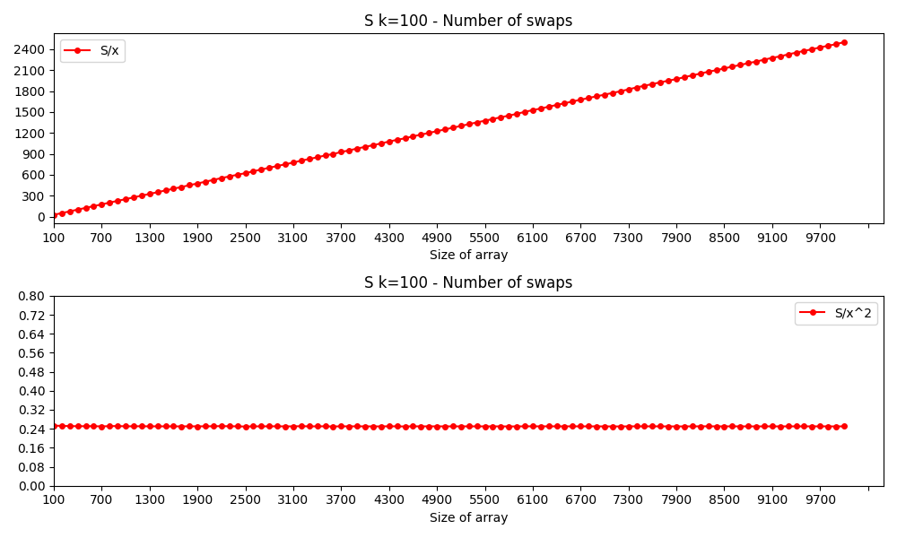

Uwaga: ten dziwny artefakt w czasie wykonywania dla k=50 i k=100 prawdoopdobnie jest spowodowany tym, że liczyłem kilka symulacji na raz i pod koniec zużycie procesora sięgało ~95%.